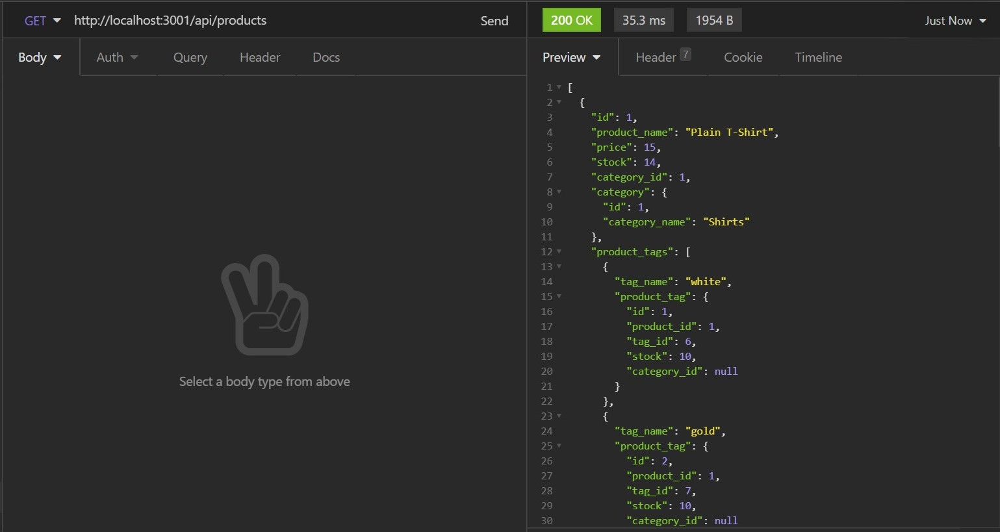

# E-commerce Back End

## Description

In this project (e-commerce back end), a back end for e-commerce websites was built using Express.js API and configured to use Sequelize to interact with a MySQL database. The database contains information for tags, products, and categories of products.

Please [click here](https://www.youtube.com/watch?v=Z93fdprTjbw) to be directed to a walkthrough video of the application.

## Installation

This application has been created using node.js and MySQL. To run this application please make sure to have node.js and MySQL installed in your machine and follow the steps below:

- Create an .env file to store the database name, username and password as shown below:

        DB_NAME='ecommerce_db'
        DB_USER='YOUR_USERNAME'
        DB_PW='YOUR_PASSWORD'

- In the command line, run `<npm install>` to install all dependencies;

- In the command line run `<npm run seed>` to seed the database;

- In the command line run `<npm start>` to start the server.

## Usage

Below screenshots of some of the features for reference.

- Creating a new product;

  

- Updating a product

  

- Finding all products;

  

- Creating a category;

  

- Finding all categories;

  

- Deleting a tag;

  
